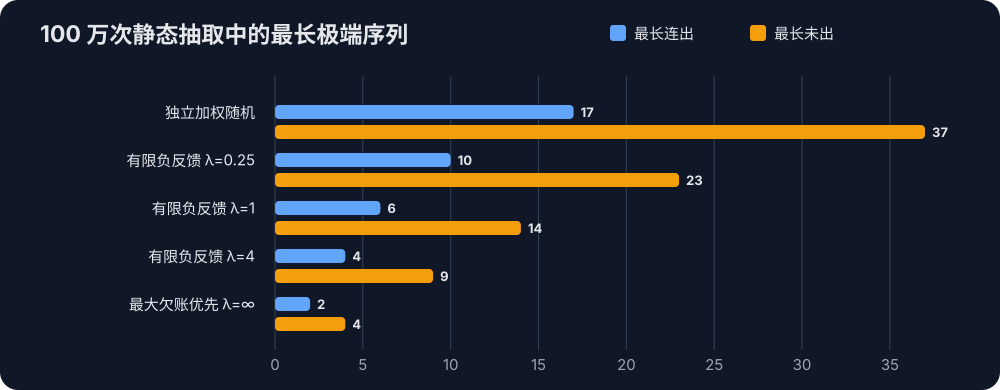

今天在游戏业务里遇到一个随机体验问题：一个常驻在玩家身上的随机池会在 A、B、C 三类结果中选择一个，基础权重是 30、30、40。我们希望长期结果符合 30%/30%/40%，又不希望同一个结果连续出现很多次，或者某个结果很久都不出现。

独立随机没有算错，但它不保证局部序列“看起来公平”。负反馈要做的并不是修复随机数生成器，而是在接受结果不再相互独立的前提下，用历史状态压低极端体验。

本文依次讨论四组方法：

1. 独立加权随机，作为基线；
2. 静态二元递增概率，包括线性递增和倍增递增；
3. 多类别有限强度负反馈；
4. 最大欠账优先，也就是负反馈强度趋向正无穷时的极限。

最后再把基础概率改成动态值，回答一个更棘手的问题：如果这一击的基础暴击率和上一击不同，旧的补偿状态到底应该怎样换算？

文中的 A/B/C、暴击率和抽卡数字都是为了说明算法而简化的例子，不是线上真实配置。

## 先纠正三个容易混淆的概念

这里做的不是“加权平均”，而是**加权随机选择**。给定权重 `wᵢ`，一次抽中类别 `i` 的概率是：

```text
pᵢ = wᵢ / Σw
```

权重不必预先加起来等于 100。`3/3/4`、`30/30/40` 和 `0.3/0.3/0.4` 表达的是同一个类别分布。

其次，随机数源通常从 `[0,1)` 上的均匀分布取值。一次 A/B/C 选择服从类别分布；多次抽取的类别计数服从多项分布；只看 A 的出现次数时才是二项分布。只有在满足条件的大样本近似中，计数才可能近似正态分布。因此，“纯随机会产生极端序列”不能归因于“随机服从正态分布”。

第三，验证随机算法的常用方法叫**蒙特卡洛模拟**。它能展示一个实现的统计行为，却不能把一次样本变成数学证明。

例如 A/B/C 的概率为 30%/30%/40%，一个指定的五次窗口全部相同的概率是：

```text
0.3⁵ + 0.3⁵ + 0.4⁵ = 1.51%
```

1.51% 看起来不高，但一百万次抽取包含大量窗口，长连击出现并不奇怪。

## 基线：独立加权随机

最普通的实现是在累计权重区间中落一个均匀随机数：

```python
def weighted_choice(weights, rng):
    total = sum(weights.values())
    threshold = rng() * total
    cumulative = 0.0

    for label, weight in weights.items():
        cumulative += weight
        if threshold < cumulative:
            return label
```

如果每次都使用同一组权重，而且每次抽取互相独立，那么长期频率会依概率收敛到目标分布。但有限次样本几乎不会恰好得到配置中的整数比例。

本文固定 Python 随机种子为 `20260912`，对每种策略真实执行 1,000,000 次。独立随机得到：

| A | B | C | 最大占比误差 |
|---:|---:|---:|---:|
| 300,089 / 30.0089% | 299,875 / 29.9875% | 400,036 / 40.0036% | 0.0125% |

这完全是正常结果。配置的 30%/30%/40% 是每次抽取的概率，不是“一百万次以后必须精确出现 30 万、30 万、40 万次”的配额合同。

## 静态二元概率：递增曲线必须先校准

对于“命中/未命中”这种二元事件，常见思路是：命中后重置；连续未命中时逐步提高下一次的条件命中率。

可以选择不同的递增曲线：

```text
线性递增：qₙ = min(1, C × n)
倍增递增：qₙ = min(1, C × 2ⁿ⁻¹)
```

其中 `n` 是自上次命中以来的尝试序号，`C` 是初始概率。但 `C` 不能凭感觉设置。

假设目标长期命中率是 50%，直接使用 `25% → 50% → 100%`，一个命中周期的期望长度是：

```text
E[X] = 1 + 0.75 + 0.75 × 0.5 = 2.125
```

每个周期恰好命中一次，所以长期命中率是：

```text
1 / 2.125 ≈ 47.06%
```

它并不等于 50%。

一般情况下，第 `n` 次尝试仍能发生，意味着前 `n-1` 次全部失败：

```text
Pr(X ≥ n) = ∏(k=1..n-1) (1 - qₖ)
E[X]      = Σ(n≥1) Pr(X ≥ n)
长期命中率 = 1 / E[X]
```

因此我们可以对 `C` 做二分求解，让 `1/E[X]` 等于设计目标：

```python
def calibrate_initial_probability(target_rate, hazard, iterations=80):
    low, high = 0.0, 1.0
    for _ in range(iterations):
        initial = (low + high) / 2
        rate = 1 / expected_cycle_length(initial, hazard)
        if rate < target_rate:
            low = initial
        else:
            high = initial
    return (low + high) / 2
```

目标为 50% 时，线性递增的 `C` 约为 30.2103%，实际曲线是 `30.21% → 60.42% → 90.63% → 100%`；倍增递增的 `C` 约为 29.2893%，曲线是 `29.29% → 58.58% → 100%`。

| 策略 | 校准初始概率 | A 实际占比 | 最长连续命中 | 最长连续未命中 |
|---|---:|---:|---:|---:|
| 独立 50% | 50.0000% | 49.9641% | 19 | 18 |
| 线性递增 PRD | 30.2103% | 50.0009% | 11 | 3 |
| 倍增递增 PRD | 29.2893% | 50.0102% | 11 | 2 |

如果把“收敛更快”定义为更早到达 100% 硬保底，那么这个 50% 示例中倍增曲线确实更快。但比较两条曲线之前必须先把它们校准到相同的长期命中率；拿相同的 `C` 直接比较没有意义。

脚本会按同一套期望周期方程实时生成下面的初始概率表。它不是厂商官方表格：

| 目标长期概率 | 线性递增初始概率 | 倍增递增初始概率 |
|---:|---:|---:|
| 5% | 0.3802% | 0.0001% |
| 10% | 1.4746% | 0.0656% |
| 20% | 5.5704% | 2.2960% |
| 30% | 11.8949% | 8.5197% |
| 40% | 20.1547% | 17.8632% |
| 50% | 30.2103% | 29.2893% |
| 75% | 66.6667% | 66.6667% |

低目标概率下，倍增曲线的初始值会非常小，然后快速翻倍到硬保底。这再次说明“更快”必须说明评价指标：它能更快截断最长等待，却可能让前几次条件命中率比线性曲线低得多。

[Valve 的官方更新说明](https://www.dota2.com/springcleaning2014/)确认 Dota 2 使用过 Pseudo Random 机制来减少过分幸运或不幸运的连续触发，[官方脚本 API](https://developer.valvesoftware.com/wiki/Dota_2_Workshop_Tools/Scripting/API)也公开了 `RollPseudoRandomPercentage` 接口。但公开材料没有给出内部公式或官方 `C` 表。所以上述线性模型和查表是本文自行推导、可以复算的实现，而不是对某款游戏内部代码的复刻。

## 多类别负反馈：记录累计概率欠账

静态二元 PRD 把状态表示为“已经连续失败几次”。它很难自然推广到 A/B/C，更难处理每次都可能变化的基础概率。

可以换一种状态：对每个类别保存**累计概率欠账** `Dᵢ`。

每次抽取之前，根据本次基础概率增加期望份额：

```text
Dᵢ ← Dᵢ + pᵢ(t)
```

抽中类别 `k` 后，让它偿还一次实际结果：

```text
Dₖ ← Dₖ - 1
```

正欠账表示这个类别相对累计期望出现得少，负欠账表示它出现得多。从零状态开始，在任意第 `T` 次抽取后都存在一个记账恒等式：

```text
实际次数 Nᵢ(T) - 累计期望 Σpᵢ(t) = -Dᵢ(T)
```

注意：这个恒等式只说明误差被完整记录了，不自动证明任意选择策略都能让欠账保持有界。我们还需要规定欠账如何影响下一次选择。

## 有限强度：保留随机性

本文使用指数反馈，把基础概率和欠账组合成本次真实抽样概率：

```text
qᵢ(t) ∝ pᵢ(t) × exp(λDᵢ)
```

`λ` 是非负反馈强度：

- `λ = 0` 时，指数项恒为 1，退化为独立加权随机；
- `λ` 越大，欠账对本次选择的影响越强；
- 基础概率为零的类别仍然不会被抽中；
- 有限 `λ` 保留随机性，但不承诺某个有限检查点的计数严格相等。

核心 Python 实现如下。实际代码用减去最大 log score 的方式避免指数溢出：

```python
class DebtFeedbackSelector:
    def __init__(self, labels, feedback_strength, debts=None):
        self.labels = tuple(labels)
        self.feedback_strength = feedback_strength
        self.debts = {
            label: float((debts or {}).get(label, 0.0))
            for label in self.labels
        }

    def draw(self, weights, rng):
        total = sum(weights.values())
        probabilities = {
            label: weight / total
            for label, weight in weights.items()
        }

        for label, probability in probabilities.items():
            self.debts[label] += probability

        log_scores = {
            label: math.log(probabilities[label])
                   + self.feedback_strength * self.debts[label]
            for label in self.labels
            if probabilities[label] > 0
        }
        largest = max(log_scores.values())
        adjusted = {
            label: math.exp(score - largest)
            for label, score in log_scores.items()
        }
        chosen = weighted_choice(adjusted, rng)
        self.debts[chosen] -= 1
        return chosen
```

玩家身上只需要持久化很小的一份状态：

```json
{"A": -0.2, "B": 0.6, "C": -0.4}
```

这份状态属于玩家的常驻随机池，不按重登、自然时间或活动周期清除。

## 正无穷：最大欠账优先

当 `λ → +∞`，概率最大的类别就是欠账最大的类别。实现时无需真的计算无穷指数：

```text
1. 所有类别先增加本次期望份额
2. 选择当前欠账最大的可用类别
3. 并列时随机打破平局
4. 被选类别的欠账减 1
```

这与 [NGINX 平滑加权轮询的公开源码](https://github.com/nginx/nginx/blob/master/src/http/ngx_http_upstream_round_robin.c#L623-L653)具有相似的记账结构：候选项逐轮累加权重，选中者再扣除总权重。它是低偏差调度，不是独立随机。

它也不等同于 Shuffle Bag。Shuffle Bag 先把有限配额装进袋子再打乱；最大欠账优先则逐次追踪累计期望，更容易接受动态权重，但结果也更规则、更容易预测。

静态 `30/30/40` 恰好以 10 次为一个完整比例单位。本次实验跑了 1,000,000 次，所以最大欠账模式最终恰好得到 300,000/300,000/400,000。动态概率或不兼容的抽取次数下，累计期望可能是小数，离散结果不可能在每个时刻与它严格相等；合理目标是让误差保持很小。

## 概率改变以后，不重置，也不换算过去

类似“角色状态改变下一击基础暴击率”的场景中，基础概率可能逐次变化。[Riot 的 10.23 官方补丁](https://www.leagueoflegends.com/en-au/news/game-updates/patch-10-23-notes/)可以证明 Tryndamere 的暴击率会随 Fury 改变，但没有公开 Riot 平滑暴击序列的内部算法。这里仅把它作为动态概率的动机。

静态 PRD 的失败次数没有唯一正确的换算方法：

- 概率一变就重置，会让频繁变化反复回到较低起始概率；
- 保留失败次数、只换一张新表，已经不满足静态周期的证明前提；
- 保留累计 hazard、保留分位数或保留失败次数，分别代表不同的公平语义。

概率欠账不需要回算。过去每一步按当时的 `pᵢ(t)` 累积，未来从下一步开始使用新概率：

```text
30/30/40 → 33/33/34 → 10/20/70
```

固定种子的动态实验把一百万次分成三个阶段。表中的“误差”是该阶段实际次数减去该阶段累计期望次数：

| 策略 | 阶段权重 | 抽取数 | A 误差 | B 误差 | C 误差 |
|---|:---:|---:|---:|---:|---:|
| 动态独立随机 | 30/30/40 | 333,333 | +121.100 | -206.900 | +85.800 |
| 动态独立随机 | 33/33/34 | 333,333 | +122.110 | -8.890 | -113.220 |
| 动态独立随机 | 10/20/70 | 333,334 | -231.400 | +46.200 | +185.200 |
| 动态有限负反馈 λ=1 | 30/30/40 | 333,333 | +1.100 | -0.900 | -0.200 |
| 动态有限负反馈 λ=1 | 33/33/34 | 333,333 | -0.890 | +1.110 | -0.220 |
| 动态有限负反馈 λ=1 | 10/20/70 | 333,334 | +0.600 | -0.800 | +0.200 |
| 动态最大欠账优先 λ=∞ | 30/30/40 | 333,333 | +0.100 | +0.100 | -0.200 |
| 动态最大欠账优先 λ=∞ | 33/33/34 | 333,333 | +0.110 | +0.110 | -0.220 |
| 动态最大欠账优先 λ=∞ | 10/20/70 | 333,334 | -0.400 | +0.200 | +0.200 |

这个结果回答了最初的问题：基础概率变化时，不需要重置“初始概率”，也不需要把旧失败次数映射到新表。只要事件身份没变，就继续保存同一份欠账；每一击只按这一击的基础概率增加期望。

## 百万次实验如何统计连续段

本文只使用一个固定种子、每项 1,000,000 次的可复现实验，不做多种子分位数。它是一份具体样本，而不是最长连击统计量的完整抽样分布。

连续出现和连续未出现都按**最大连续段**计数。例如 `AAAA` 是一个长度为 4 的连续段，不是两个重叠的 `AAA` 窗口；未出现段包含实验序列开头和结尾的边界。

`≥3` 和 `≥5` 是体验阈值，不自动等于统计异常。以概率 30% 的 A 为例，连续三次未出现的概率是 `0.7³ = 34.3%`，本来就很常见。

### 长期分布

| 策略 | A 次数/占比 | B 次数/占比 | C 次数/占比 | 最大占比误差 |
|---|---:|---:|---:|---:|
| 独立加权随机 | 300,089 / 30.0089% | 299,875 / 29.9875% | 400,036 / 40.0036% | 0.0125% |
| 有限负反馈 λ=0.25 | 300,001 / 30.0001% | 300,000 / 30.0000% | 399,999 / 39.9999% | 0.0001% |
| 有限负反馈 λ=1 | 300,000 / 30.0000% | 300,001 / 30.0001% | 399,999 / 39.9999% | 0.0001% |
| 有限负反馈 λ=4 | 300,000 / 30.0000% | 300,000 / 30.0000% | 400,000 / 40.0000% | 0.0000% |
| 最大欠账优先 λ=∞ | 300,000 / 30.0000% | 300,000 / 30.0000% | 400,000 / 40.0000% | 0.0000% |

### 连续出现

| 策略 | 类别 | 最长连出 | 连出 ≥3 段数 | 连出 ≥5 段数 |
|---|:---:|---:|---:|---:|
| 独立加权随机 | A | 10 | 19,005 | 1,703 |
| 独立加权随机 | B | 13 | 18,791 | 1,690 |
| 独立加权随机 | C | 17 | 38,375 | 6,162 |
| 有限负反馈 λ=0.25 | A | 8 | 15,861 | 750 |
| 有限负反馈 λ=0.25 | B | 8 | 15,637 | 754 |
| 有限负反馈 λ=0.25 | C | 10 | 35,254 | 3,610 |
| 有限负反馈 λ=1 | A | 5 | 7,774 | 29 |
| 有限负反馈 λ=1 | B | 6 | 7,858 | 21 |
| 有限负反馈 λ=1 | C | 6 | 23,717 | 467 |
| 有限负反馈 λ=4 | A | 3 | 135 | 0 |
| 有限负反馈 λ=4 | B | 3 | 154 | 0 |
| 有限负反馈 λ=4 | C | 4 | 2,269 | 0 |
| 最大欠账优先 λ=∞ | A | 1 | 0 | 0 |
| 最大欠账优先 λ=∞ | B | 1 | 0 | 0 |
| 最大欠账优先 λ=∞ | C | 2 | 0 | 0 |

### 连续未出现

| 策略 | 类别 | 最长未出 | 未出 ≥3 段数 | 未出 ≥5 段数 |
|---|:---:|---:|---:|---:|
| 独立加权随机 | A | 37 | 102,885 | 50,454 |
| 独立加权随机 | B | 30 | 102,636 | 50,483 |
| 独立加权随机 | C | 27 | 86,113 | 31,072 |
| 有限负反馈 λ=0.25 | A | 23 | 108,924 | 50,999 |
| 有限负反馈 λ=0.25 | B | 21 | 109,147 | 50,788 |
| 有限负反馈 λ=0.25 | C | 18 | 89,333 | 27,853 |
| 有限负反馈 λ=1 | A | 14 | 121,669 | 45,032 |
| 有限负反馈 λ=1 | B | 14 | 121,851 | 44,956 |
| 有限负反馈 λ=1 | C | 10 | 90,797 | 15,944 |
| 有限负反馈 λ=4 | A | 9 | 132,616 | 11,901 |
| 有限负反馈 λ=4 | B | 8 | 132,398 | 11,905 |
| 有限负反馈 λ=4 | C | 6 | 52,264 | 327 |
| 最大欠账优先 λ=∞ | A | 4 | 124,955 | 0 |
| 最大欠账优先 λ=∞ | B | 4 | 124,955 | 0 |
| 最大欠账优先 λ=∞ | C | 2 | 0 | 0 |



实验最明显的变化发生在长尾：独立随机的最长连出为 17，最长未出为 37；`λ=1` 时分别降到 6 和 14；最大欠账模式降到 2 和 4。

但“未出 ≥3 的段数”并不随反馈强度单调下降。强反馈会把少量很长的缺口整理成更多、但更短且更规律的缺口，所以最大长度和 `≥5` 段数下降时，`≥3` 段数反而可能增加。只看一个阈值次数，很容易对算法作出相反判断。

## 怎样复现实验

完整实现、测试和生成结果都保存在 `scripts/weighted_random/`。运行：

```bash
npm run test:weighted-random
npm run simulate:weighted-random
```

模拟脚本只使用 Python 标准库，固定种子和抽取次数都可以覆盖：

```bash
python3 scripts/weighted_random/simulate.py \
  --draws 1000000 \
  --seed 20260912
```

命令会生成原始 JSON、可直接贴入文章的 Markdown 表格，以及最长极端序列 SVG。测试还会验证：

- `25% → 50% → 100%` 的长期率确实是 `8/17`；
- 线性和倍增曲线校准后达到目标理论长期率；
- 动态权重下，实际次数、累计期望和欠账满足记账恒等式；
- 最大欠账模式在静态完整比例周期上得到精确配额；
- 玩家欠账状态可以保存并恢复；
- 连续段按不重叠最大段、且包含序列边界统计。

## 这个方案的边界

第一，有限强度的指数反馈是本文采用的工程模型，不是 Valve、Riot 或某个统计标准公开规定的算法。百万次实验显示它能显著压缩偏差和长尾，但实验不能代替对所有动态输入的有界性证明。

第二，反馈越强，结果越容易预测。最大欠账模式适合强配额、非对抗性的常驻选择；战斗暴击等需要保留不可预测性的场景，更适合有限 `λ` 和服务端随机源。

第三，Python 示例使用浮点数以保持可读性。若生产系统需要严格可重放和跨语言一致，应使用定点整数保存权重与欠账，并明确舍入规则。

第四，持久化欠账属于概率协议的一部分。服务端应把类别标识、欠账值、算法版本和参数一起保存；不能只持久化“连续失败次数”，却在运行时悄悄换成另一条概率曲线。

## 结论

纯随机与负反馈并不是“错误”和“正确”的关系，而是两种不同承诺：

- 独立加权随机承诺每次条件概率正确，但允许局部极端序列；
- 静态二元 PRD 通过校准后的递增 hazard 压缩连续未命中的尾部；
- 累计概率欠账把多类别和动态概率统一到同一份持久状态；
- 有限反馈在分布跟踪和不可预测性之间折中；
- 最大欠账优先把折中推到强配额极限。

真正需要配置的不是一个模糊的“更随机”开关，而是产品愿意接受多少局部波动、多少可预测性，以及长期概率究竟是统计目标还是有限窗口内的硬配额。

关于前缀误差的数学背景，可以继续阅读 Knuth 的 [Two-way rounding](https://arxiv.org/abs/math/9504228)。它支持“逐步累积份额、控制舍入误差”的方向，但不应被当成本文有限指数反馈公式的直接证明。
